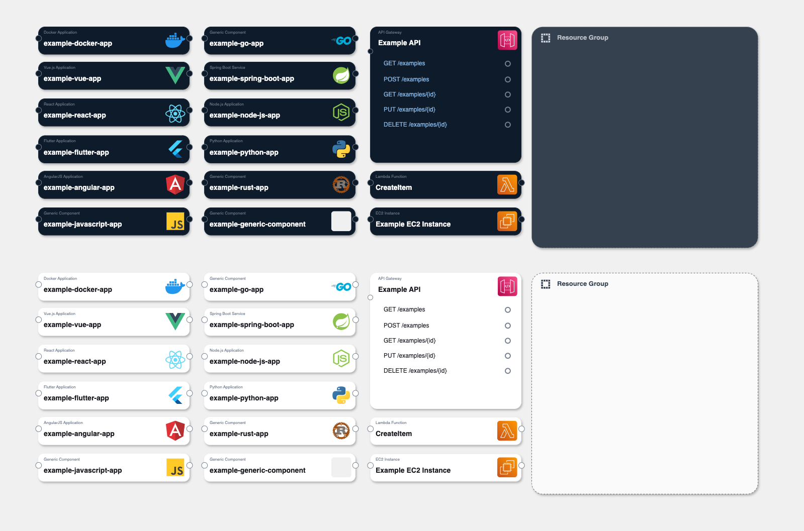
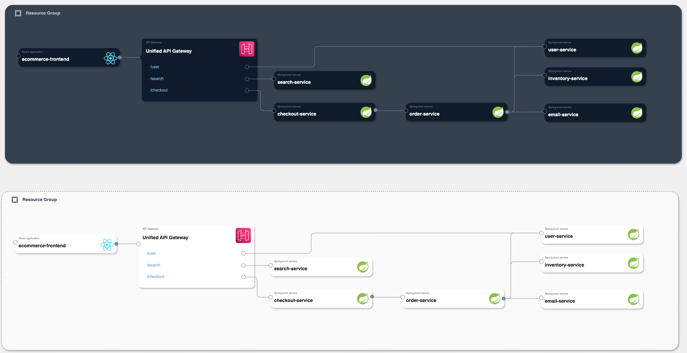

<h3 align="center">AWS-Inspired Draw.io Component Library</h3>

  

    AWS Infrastructure Composer inspired Draw.io library for creating visually appealing diagrams!
     
<a href="https://app.diagrams.net/?splash=0&clibs=Uhttps%3A%2F%2Fraw.githubusercontent.com%2Falexbaeza%2Faws-infrastructure-composer-drawio-library%2Frefs%2Fheads%2Fmain%2Faws-infrastructure-composer-inspired-light-theme.drawio"><strong>» Install Light Theme Components</strong></a> 
    <a href="https://app.diagrams.net/?splash=0&clibs=Uhttps%3A%2F%2Fraw.githubusercontent.com%2Falexbaeza%2Faws-infrastructure-composer-drawio-library%2Frefs%2Fheads%2Fmain%2Faws-infrastructure-composer-inspired-dark-theme.drawio"><strong>» Install Dark Theme Components</strong></a>
     
     
  

## 🌟 Overview

Welcome to the AWS-Inspired Draw.io Component Library! This library contains visually appealing components inspired by
AWS’s Infrastructure Composer design and color palette. It’s perfect for creating professional and modern architecture
diagrams in both light and dark modes.

- A rich set of components designed to match AWS’s Infrastructure Composer style.
- light and dark components.
- Ideal for creating high-level architecture diagrams.

Here's an example of what your 'cool' diagrams could look like:

---

## 🚀 Installation

You can load the library into Draw.io by following one of the methods below:

### 1. **Click to Load**

Use the links below to directly load the libraries into Draw.io:

[» Load Light Theme - AWS-Infrastructure Composer Inspired Library](https://app.diagrams.net/?splash=0&clibs=Uhttps%3A%2F%2Fraw.githubusercontent.com%2Falexbaeza%2Faws-infrastructure-composer-drawio-library%2Frefs%2Fheads%2Fmain%2Faws-infrastructure-composer-inspired-light-theme.drawio)

[» Load Dark Theme - AWS-Infrastructure Composer Inspired Library](https://app.diagrams.net/?splash=0&clibs=Uhttps%3A%2F%2Fraw.githubusercontent.com%2Falexbaeza%2Faws-infrastructure-composer-drawio-library%2Frefs%2Fheads%2Fmain%2Faws-infrastructure-composer-inspired-dark-theme.drawio)

### 2. **Manual Installation**

1. Download the XML library files in this repo.
2. Open Draw.io.
3. Go to **File > Open Library from > Device**.
4. Select the downloaded `.xml` file.

---

## ✨ How to Use

1. Once the library is loaded, it will appear in the left sidebar.
2. Drag and drop components into your workspace.
3. Customize as needed for your architecture diagrams.

## ⚠️ Disclaimer

This library is for educational and personal use only. We do not own the logos and designs used within this library. All
trademarks and logos are the property of their respective owners. Please ensure compliance with licensing terms before
using these assets in your projects.

